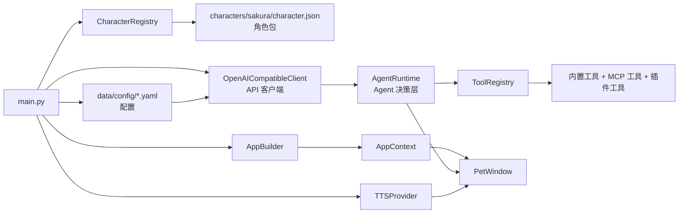

[English](README.en.md)

# Sakura Desktop Pet

一个桌面上的角色 Agent——能聊天、换表情、用语音说话、记住你允许的事，也会在确认后帮你处理任务。它不只是「桌宠+聊天」，而是一个桌面陪伴型 Agent。


## 设计思路

普通 AI 聊天窗口只是一个会回答问题的文本框。Sakura 想做的是另一种体验：角色一直停在桌面上，用自己的语气说话，用立绘表达情绪，能在需要时查时间、记提醒、读网页，也可以在你允许时看一眼屏幕。

模型的回复按段落组织为双语 JSON 片段（日文原文 + 中文字幕 + 语气标签），UI 对同一份结构同步驱动字幕、表情和可选的 TTS。

## 核心功能

- **角色包驱动。** `CharacterRegistry` 扫描 `characters/*/character.json`，校验角色卡、立绘和语音参考资源。

- **分段双语回复。** 模型返回 JSON 片段，每段包含日文、中文和语气标签，UI 同步显示字幕、切换立绘、播放语音。

- **语气联动表情和语音。** 语气同时驱动立绘切换和 TTS 参考音频选择，支持 GPT-SoVITS 权重切换。

- **Agent 工具循环。** `AgentRuntime` 每轮先让模型规划是否需要工具，再执行待办、提醒、笔记、记忆、浏览器、屏幕观察等工具。

- **按需/自主屏幕观察。** 模型可在对话中请求当前屏幕截图，或自动决定是否获取屏幕信息。

- **主动关怀。** 周期性根据上下文状态主动搭话，可选择附带屏幕信息。

- **受控浏览器 + 桌面操作。** 通过 MCP Playwright / Windows MCP 工具支持浏览器和本地桌面交互。

- **长期记忆与候选确认。** 长期记忆先写候选，用户确认后才写入正式记忆。支持自动记忆整理。

- **MCP 扩展。** `data/config/mcp.yaml` 注册 stdio/SSE MCP Server，支持运行时开关。

- **历史回看与回溯、立绘动效、上下文修剪、调试日志。**

## 启动流程

运行 `python main.py` 后：

1. 创建 `QApplication`
2. `AppSettingsService` 从 `data/config/api.yaml` 加载 API 配置
3. `CharacterRegistry` 扫描角色包
4. 加载角色人格卡和可用语气/立绘
5. `AppBuilder` 组装 `AppContext`——包括工具注册表、记忆库、提醒库、MCP、插件、TTS
6. 后台线程装配耗时服务（MCP 工具、插件、TTS Provider）
7. 显示 `PetWindow`



## 项目结构

```text
.
├── main.py                             # 应用入口
├── app/
│   ├── agent/                          # Agent 决策层
│   │   ├── actions.py                  # 动作/事件/待确认数据结构
│   │   ├── builtin_tools.py            # 内置工具（待办/提醒/笔记/记忆等）
│   │   ├── memory.py / reminders.py    # 长期记忆 / 提醒
│   │   ├── memory_curator.py           # 自动记忆整理
│   │   ├── runtime.py                  # AgentRuntime（决策/工具循环）
│   │   ├── runtime_limits.py           # 运行时限制常量
│   │   ├── screen_policy.py            # 屏幕观察策略
│   │   ├── screen_tools.py             # 屏幕观察工具
│   │   ├── screen_observation.py       # 屏幕观察入口
│   │   ├── proactive_care.py           # 主动关怀
│   │   ├── tool_policy.py              # 工具路由策略
│   │   ├── tool_registry.py            # 兼容层（→ app/agent/tools/）
│   │   ├── tools/                      # 统一工具注册系统
│   │   │   ├── registry.py             # ToolRegistry / Tool / ToolMetadata
│   │   │   ├── permission_policy.py    # ToolPermissionPolicy
│   │   │   └── builtin/provider.py     # BuiltinToolProvider
│   │   └── mcp/                        # MCP 工具（桥接/配置/Provider）
│   ├── core/                           # 应用核心
│   │   ├── app_context.py              # AppContext 依赖容器
│   │   ├── bootstrap.py                # 启动装配
│   │   ├── builder/                    # AppBuilder / ServiceContainer / Lifecycle
│   │   ├── chat_pipeline.py            # ChatPipeline 对话编排
│   │   ├── chat_worker.py              # Qt 后台线程 Worker
│   │   ├── debug_log.py                # 调试日志（自动脱敏）
│   │   ├── extensions.py               # 扩展注册表
│   │   ├── plugin_manager.py           # SakuraPluginManager（兼容层 → app/plugins/）
│   │   └── runtime/                    # 运行时编排
│   ├── config/                         # 配置管理
│   │   ├── models.py                   # 配置数据模型
│   │   ├── defaults.py                 # 默认值
│   │   ├── settings_service.py         # YAML 配置读写
│   │   ├── migrations.py               # .env → YAML 迁移
│   │   ├── character_loader.py         # 角色包加载
│   │   └── yaml_config.py              # YAML 通用工具
│   ├── llm/                            # LLM 客户端
│   │   ├── api_client.py               # OpenAI 兼容客户端
│   │   ├── chat_reply.py               # 分段回复解析
│   │   ├── context_trimming.py         # 上下文修剪
│   │   ├── prompt_templates.py         # 提示词模板
│   │   └── prompts/                    # 提示词块/渲染
│   ├── plugins/                        # 插件系统（原生）
│   │   ├── models.py                   # PluginManifest / PluginSpec / Contribution
│   │   ├── discovery.py                # PluginDiscovery
│   │   ├── capabilities.py             # PluginCapabilityRegistry
│   │   ├── manager.py                  # PluginManager
│   │   └── adapters.py                 # SDK 兼容适配
│   ├── storage/                        # 存储层
│   │   ├── paths.py                    # StoragePaths 统一路径
│   │   ├── chat_history.py             # 聊天历史（JSONL）
│   │   └── visual_observation.py       # 视觉观察记录（JSONL）
│   ├── ui/                             # UI 组件
│   │   ├── pet_window.py               # 桌宠主窗口
│   │   ├── settings_dialog.py          # 设置对话框
│   │   ├── history_window.py           # 历史回看
│   │   ├── portrait_controller.py      # 立绘控制器
│   │   ├── subtitle_controller.py      # 字幕控制器
│   │   ├── tool_confirmation_panel.py  # 工具确认面板
│   │   ├── portrait_utils.py           # 立绘工具函数
│   │   └── ...（其余 UI 组件）
│   └── voice/                          # 语音
│       ├── tts.py                      # GPT-SoVITS / Null Provider
│       └── playback_controller.py      # 语音播放控制器
├── sdk/                                # Shinsekai 兼容层（已废弃，新插件用 app/plugins/）
│   ├── plugin.py                       # PluginBase
│   ├── register.py                     # PluginCapabilityRegistry
│   ├── types.py                        # 贡献点类型
│   └── tool_registry.py                # 已废弃工具装饰器
├── plugins/                            # 本地插件
│   └── playwright_browser/             # Playwright 浏览器插件
├── characters/sakura/                  # 角色资源
├── data/                               # 本地数据
│   ├── config/                         # YAML 配置（api.yaml / system_config.yaml 等）
│   ├── chat_history/                   # 聊天记录
│   ├── memory/                         # 长期记忆
│   └── visual_observations/            # 视觉观察记录
├── tests/                              # pytest 测试
│   ├── unit/                           # 单元测试
│   ├── integration/                    # 集成测试
│   └── ui/                             # UI 测试
├── docs/                               # 文档
│   ├── ARCHITECTURE.md                 # 架构说明
│   ├── MIGRATION.md                    # 迁移指南
│   └── SAKURA_PLUGIN_SDK.md            # 插件开发指南
└── tools/mcp/                          # MCP Server 运行时
```

## 快速开始

**前置要求：** Python 3.10+。

```powershell
# 1. 创建并激活虚拟环境
python -m venv .venv
.\.venv\Scripts\Activate.ps1

# 2. 安装依赖
pip install -r requirements.txt

# 3. 编辑配置（至少填入 API Key）
# 编辑 data/config/api.yaml，修改 llm.api_key 和 llm.base_url
notepad data/config/api.yaml

# 4. 启动桌宠
python main.py
```

**最低配置 `data/config/api.yaml`：**

```yaml
llm:
  base_url: https://api.openai.com/v1
  api_key: your_api_key_here
  model: gpt-4.1-mini
  timeout_seconds: 60
```

启动后，你应该能在屏幕右下附近看到夜乃桜。右键桌宠或托盘图标可以打开设置、历史记录等菜单。

## 可选语音配置

语音默认关闭。需要自行启动兼容以下接口的本地 GPT-SoVITS API：

- `POST /tts`
- `GET /set_gpt_weights`
- `GET /set_sovits_weights`

在 `data/config/api.yaml` 或设置窗口中启用：

```yaml
tts:
  provider: gpt-sovits
  enabled: true
  gpt_sovits:
    api_url: http://127.0.0.1:9880/tts
    ref_lang: ja
    text_lang: ja
    timeout_seconds: 60
```

## 配置项

所有配置集中在 `data/config/` 下的 YAML 文件中。

| YAML 路径 | 作用 | 默认值 |
|---|---|---|
| `api.yaml: llm.base_url` | API 地址 | `https://api.openai.com/v1` |
| `api.yaml: llm.api_key` | API Key | 空 |
| `api.yaml: llm.model` | 模型名称 | `gpt-4.1-mini` |
| `api.yaml: llm.timeout_seconds` | 超时时间 | `60` |
| `api.yaml: tts.enabled` | 启用 TTS | `false` |
| `api.yaml: tts.gpt_sovits.api_url` | TTS 接口 | `http://127.0.0.1:9880/tts` |
| `system_config.yaml: ui.subtitle_language` | 气泡语言 `ja`/`zh` | `ja` |
| `system_config.yaml: ui.portrait_scale_percent` | 立绘缩放 | `100` |
| `system_config.yaml: proactive_care.enabled` | 主动关怀 | `false` |
| `system_config.yaml: proactive_care.check_interval_minutes` | 检查间隔 | `20` |
| `system_config.yaml: proactive_care.cooldown_minutes` | 冷却时间 | `10` |
| `system_config.yaml: memory_curation.enabled` | 自动记忆整理 | `true` |
| `system_config.yaml: mcp.windows_enabled` | Windows MCP | `false` |
| `system_config.yaml: debug.enabled` | 调试日志 | `false` |
| `characters.yaml: current_character_id` | 当前角色 | `sakura` |

> **从旧配置迁移？** 如果你还在用 `.env` 格式，参见 [MIGRATION.md](/D:/Project/sakura/docs/MIGRATION.md)。

## 测试

```powershell
python -m pytest
```

## 许可证

仓库根目录目前没有提供 `LICENSE` 文件。重新分发角色资源、模型权重或第三方运行前，请分别确认对应文件的授权。
